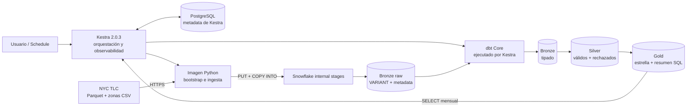
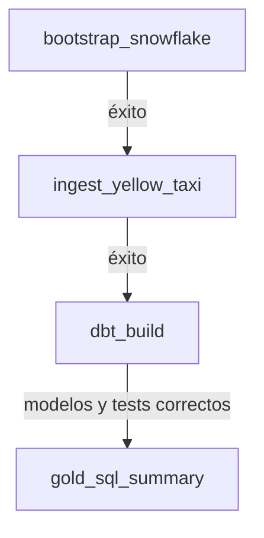

# Arquitectura Kestra + Snowflake + dbt

## Flujo Kestra

El archivo declarativo del flujo es
`kestra/flows/main_lab.semana07.nyc_yellow_taxi_elt.yml`. Compose monta esa carpeta
en modo de solo lectura y Kestra la carga al iniciar mediante `--flow-path`, por lo
que la orquestación queda versionada junto al código sin permitir que la interfaz
modifique los archivos del repositorio.
