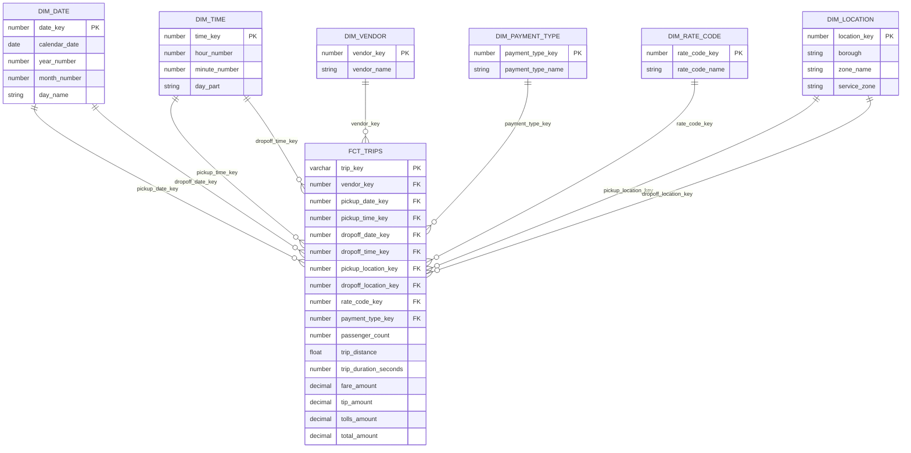

# Esquema estrella

El grano de `FCT_TRIPS` es un viaje Yellow Taxi válido identificado por la combinación
estable de archivo y número de fila de origen.

```mermaid
erDiagram
    DIM_DATE ||--o{ FCT_TRIPS : pickup_date_key
    DIM_DATE ||--o{ FCT_TRIPS : dropoff_date_key
    DIM_TIME ||--o{ FCT_TRIPS : pickup_time_key
    DIM_TIME ||--o{ FCT_TRIPS : dropoff_time_key
    DIM_VENDOR ||--o{ FCT_TRIPS : vendor_key
    DIM_PAYMENT_TYPE ||--o{ FCT_TRIPS : payment_type_key
    DIM_RATE_CODE ||--o{ FCT_TRIPS : rate_code_key
    DIM_LOCATION ||--o{ FCT_TRIPS : pickup_location_key
    DIM_LOCATION ||--o{ FCT_TRIPS : dropoff_location_key

    FCT_TRIPS {
        varchar trip_key PK
        number vendor_key FK
        number pickup_date_key FK
        number pickup_time_key FK
        number dropoff_date_key FK
        number dropoff_time_key FK
        number pickup_location_key FK
        number dropoff_location_key FK
        number rate_code_key FK
        number payment_type_key FK
        number passenger_count
        float trip_distance
        number trip_duration_seconds
        decimal fare_amount
        decimal tip_amount
        decimal tolls_amount
        decimal total_amount
    }

    DIM_DATE {
        number date_key PK
        date calendar_date
        number year_number
        number month_number
        string day_name
    }

    DIM_TIME {
        number time_key PK
        number hour_number
        number minute_number
        string day_part
    }

    DIM_VENDOR {
        number vendor_key PK
        string vendor_name
    }

    DIM_PAYMENT_TYPE {
        number payment_type_key PK
        string payment_type_name
    }

    DIM_RATE_CODE {
        number rate_code_key PK
        string rate_code_name
    }

    DIM_LOCATION {
        number location_key PK
        string borough
        string zone_name
        string service_zone
    }
```
